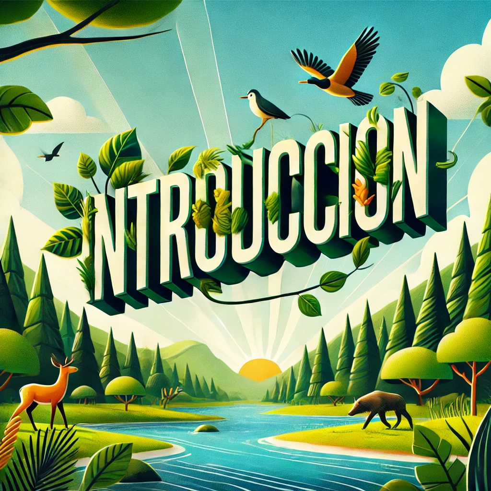

---

Podemos definir los retos ambientales y sociales a los que se enfrenta la sociedad como desafíos complejos a los que se enfrentan las sociedades debido al impacto de las actividades humanas en el medio ambiente y las dinámicas sociales. Estos retos están relacionados entre sí y afectan tanto al bienestar humano como al equilibrio de los ecosistemas. En este trabajo veremos más en detalle Principales retos ambientales y sociales, el impacto de los actuales problemas medioambientales y las medidas y acciones para minimizar los impactos ambientales.

