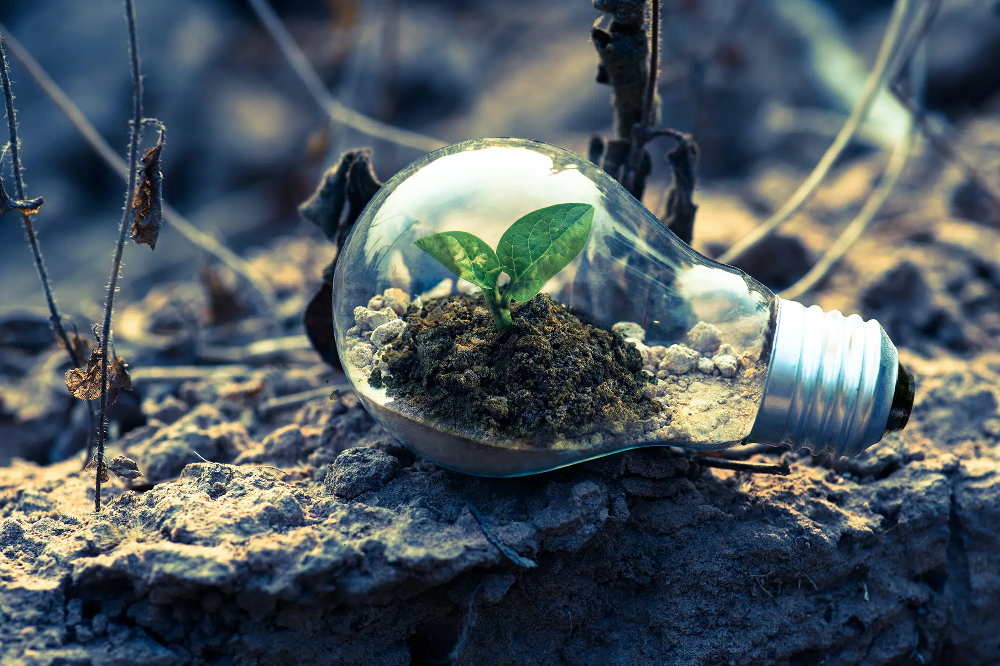

# Medidas y acciones para minimizar los impactos ambientales.

---

Algunas de las me didas más comunes son ahorrar agua, evitar el consumo excesivo de energía, separar los residuos orgánicos y reciclables, disminuir el uso de automóviles, consumir solo lo necesario y evitar las compras compulsivas, usar productos ecológicos y biodegradables y no tirar basura a las calles.

El uso consciente de los recursos naturales, la conciencia de las generaciones futuras sobre la preservación ambiental y la creación de leyes que garanticen la preservación del medio ambiente son también fundamentales medidas para reducir el impacto ambiental. Como todos los desafíos que enfrentamos, la concientización debe comenzar desde el individuo y poco a poco se irá expandiendo hacia la sociedad.

