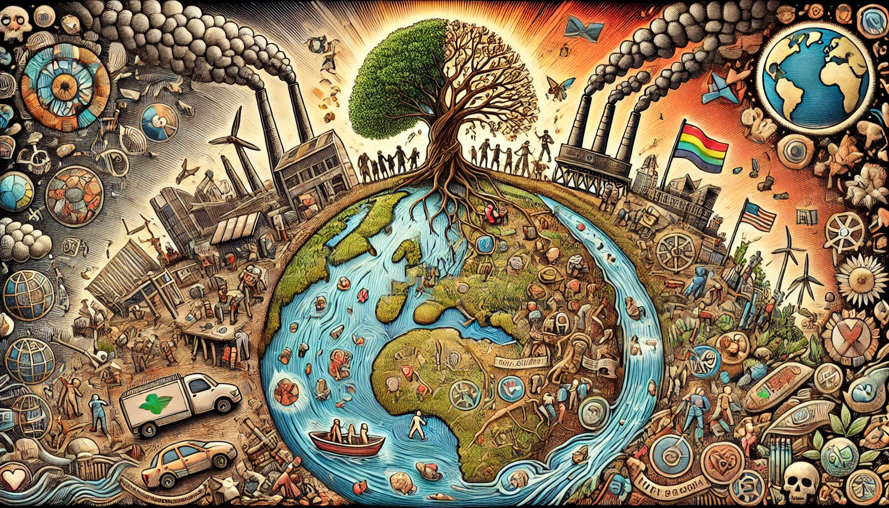

# Principales retos ambientales y sociales 

## Los principales retos ambientales y  sociales que estamos sufriendo como humanidad son los siguientes:

Para comenzar, mencionaremos los principales retos ambientales, estos son los suiguientes:
1. El cambio climatico, es causado por la emision de gases como CO2, esto provoca cambios en el clima y en la meteorológia. 
2. La pérdida de Biodiversidad, esta llevando a la extinción de especies animales y vegetales afectando así a los ecosistemas que sostienen la vida en el planeta.
3. La contaminación, llega tanto al aire, agua y suelo, esta es una problematica grave. El uso excesivo de plásticos y la mala gestión de residuos estan afectando a la salud humana como a la de los 
   ecosistemas.
4. La escasez de recursos naturales, se debe al consumo excesivo e insostenible de agua, de minerales y también de combustibles fósiles.
5. La deforestación, se debe a la tala masiva de bosques para expandir la agricultura, asimismo la urbanización está reduciendo los pulmones verdes del planeta, por lo que disminuye la capacidad de los 
   ecosistemas para regular el clima y producir oxígeno.
6. El desperdicio de elementos, produce una gran cantidad de emisiones de gases de efecto invernadero y es un desperdicio de recursos naturales.

De igual forma, mencionaremos también los principales retos sociales; los cuales son los suiguientes:
1. Desigualdad social:
2. Acceso a la educación:
3. Desempleo y condiciones laborales precarias:
4. Migración forzada y desplazamiento:
5. Derechos humanos y justicia social:
6. Salud pública:

1. La desigualdad social, es una distribución inequitativa de recursos, oportunidades y poder entre distintos grupos, lo que perpetúa la pobreza, exclusión y falta de acceso a servicios básicos para las comunidades más vulnerables.

2. El acceso a la educación, se refierea las  personas que carecen de oportunidades educativas debido a barreras económicas, geográficas, culturales o de género, lo que limita su desarrollo personal y contribuye a la perpetuación de la pobreza.

3.  El desempleo y condiciones laborales precarias, son  el acceso limitado a empleos dignos y bien remunerados afecta la estabilidad económica de las familias y perpetúa la desigualdad, especialmente en sectores vulnerables como mujeres y jóvenes.

4. La migración forzada y desplazamiento, son los factores como conflictos, violencia, desastres naturales y el cambio climático obligan a millones a abandonar sus hogares, enfrentando discriminación y falta de oportunidades en los lugares a los que migran.

5. Los derechos humanos y justicia social, son las comunidades que enfrentan discriminación, violencia y negación de sus derechos fundamentales, lo que socava la igualdad y la cohesión social.

6.  Y por último, la salud pública, su acceso es desigual a servicios de salud, infraestructuras deficientes y desafíos globales como pandemias y enfermedades crónicas afectan la calidad de vida y aumentan las disparidades sociales.

